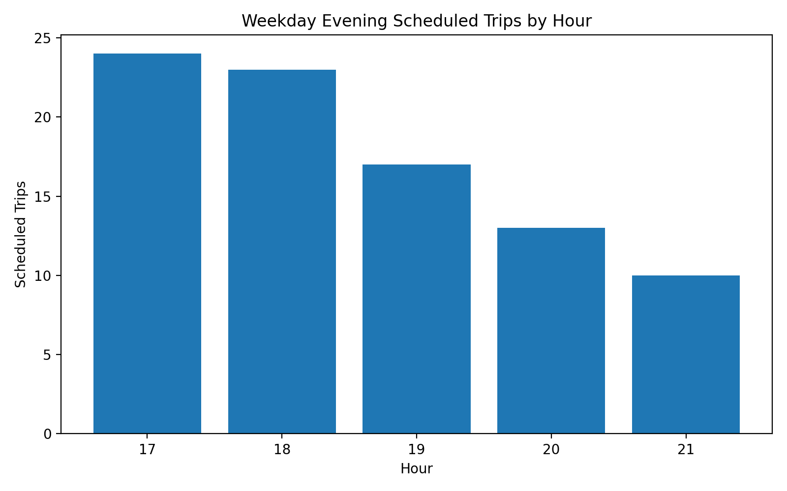
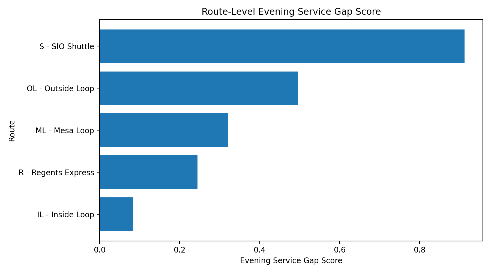
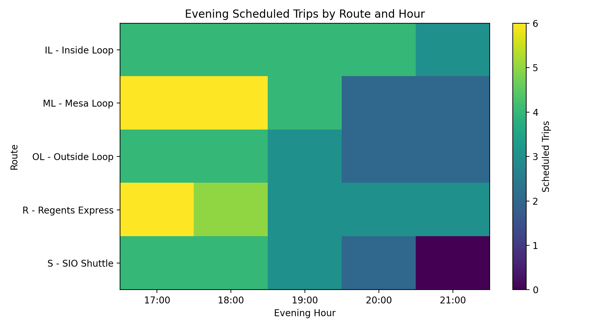
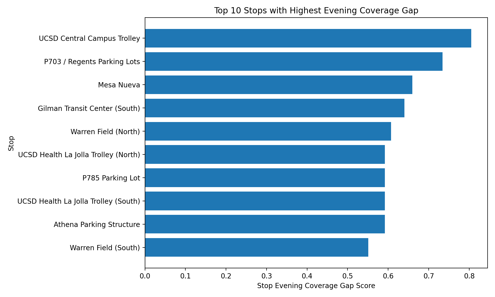

# UCSD Triton Transit Evening Service Gap Diagnosis & Schedule Optimization

## UCSD 校园班车晚间服务供给缺口诊断与排班优化项目

## 项目概览

本项目基于 UCSD Triton Transit 最新 GTFS static feed，围绕校园班车晚间服务体验问题，从排班供给侧诊断当前晚间服务缺口，并提出可执行的排班优化方案。

项目重点不是简单判断“有没有班车”，而是回答：

> 晚间服务缺口主要集中在哪些时间段、路线和站点？  
> 如果运营资源有限，应该优先优化哪些路线和时段？

本项目模拟真实业务分析流程，包含数据质量检查、指标体系搭建、路线与站点缺口诊断、优化优先级排序和排班优化方案设计。

---

## 业务问题

UCSD Triton Transit 是 UCSD 校园交通服务的重要组成部分。晚间班车服务会影响学生在下课后、晚自习后、实验室结束后以及停车场往返校园时的出行体验。

本项目将业务问题拆解为四个具体问题：

1. 17:00–22:00 之间，哪些小时段的计划班次最少？
2. 哪些路线的晚间服务缺口最大？
3. 哪些站点全天服务较多，但晚间覆盖不足？
4. 在运营资源有限的情况下，应该优先调整哪些路线、站点和时间段？

---

## 数据来源

本项目使用 UCSD Triton Transit 最新 GTFS static feed。

使用的核心 GTFS 表包括：

| 表名 | 作用 |
|---|---|
| `routes.txt` | 路线信息 |
| `trips.txt` | 班次信息 |
| `stop_times.txt` | 每个班次的站点到达顺序和时间 |
| `stops.txt` | 站点名称和经纬度 |
| `calendar.txt` | 服务日期规则 |
| `calendar_dates.txt` | 特殊日期服务调整 |

本项目分析的是 **scheduled service supply（计划排班供给）**，不是实时车辆运行表现。因此，本项目可以回答“排班供给是否充足”，但不直接分析车辆是否晚点、是否临时取消或实际乘客需求。

---

## 分析方法

本项目采用业务分析项目常用流程：

1. **数据质量检查**  
   检查 GTFS 核心表是否完整，确认 `routes`、`trips`、`stop_times`、`stops` 等表可以正常连接。

2. **构建服务分析宽表**  
   将 `stop_times`、`trips`、`routes`、`stops` 进行连接，形成 trip-level 和 stop-level 分析表。

3. **计算晚间服务指标**  
   计算每小时计划班次数、估算发车间隔、晚间服务占比、末班车时间、站点晚间覆盖率等指标。

4. **定位服务缺口**  
   从时间段、路线、站点三个维度找出晚间服务薄弱环节。

5. **设计 Evening Service Gap Score**  
   将多个服务缺口指标合成为路线级优先级评分，用于判断哪些路线最需要优化。

6. **模拟排班优化方案**  
   根据路线优先级，模拟增加晚间班次、延后末班车后的核心指标改善情况。

---

## 核心指标体系

| 指标 | 中文解释 | 业务含义 |
|---|---|---|
| `hourly_service_frequency` | 每小时计划班次数 | 衡量某小时段服务供给强度 |
| `estimated_headway_min` | 估算发车间隔 | 班次越少，理论等待时间越长 |
| `evening_service_share` | 晚间班次占比 | 衡量路线资源是否向晚间倾斜 |
| `last_trip_time` | 末班车时间 | 判断路线是否过早结束服务 |
| `route_service_span` | 路线服务时长 | 衡量路线全天运营覆盖范围 |
| `stop_evening_coverage_rate` | 站点晚间覆盖率 | 衡量站点晚间服务是否不足 |
| `Evening Service Gap Score` | 晚间服务缺口评分 | 用于路线优化优先级排序 |

---

## 核心发现

### 发现一：晚间服务从 20:00 后明显变弱

从工作日正常服务来看，17:00–22:00 的计划班次数呈逐步下降趋势。  
其中 21:00–22:00 是晚间服务供给最低的时段。

这说明晚间服务缺口并不是平均分布的，而是主要集中在较晚时段，尤其是 20:00 之后。



---

### 发现二：路线级服务缺口集中在少数路线

路线级 Evening Service Gap Score 显示，不同路线之间的晚间服务缺口差异明显。  
部分路线存在晚间班次少、估算发车间隔长、末班车偏早等问题，因此应被优先纳入排班优化。



---

### 发现三：路线和小时的服务缺口分布不均匀

路线 × 小时热力图显示，晚间服务缺口并不是所有路线同时下降，而是部分路线在 20:00 后服务明显变弱。

这类结果可以帮助运营方判断：

- 哪些路线需要优先补班；
- 哪些小时段最适合增加服务；
- 是否需要将低峰资源转移到晚间高缺口时段。



---

### 发现四：部分高访问站点晚间覆盖不足

站点级分析显示，部分站点全天访问次数较高，但晚间覆盖率偏低。  
这类站点可能靠近宿舍区、停车场、换乘点或校园主要活动区域，适合被列为重点站点覆盖补强对象。



---

## Evening Service Gap Score 设计

为了将“晚间服务体验差”这个模糊问题量化，本项目设计了路线级 **Evening Service Gap Score**。

评分由三部分组成：

```text
Evening Service Gap Score =
0.40 × Headway Score
+ 0.35 × Early Last Trip Score
+ 0.25 × Low Evening Share Score
```

其中：

- `Headway Score`：晚间估算发车间隔越长，得分越高；
- `Early Last Trip Score`：末班车越早，得分越高；
- `Low Evening Share Score`：晚间班次占比越低，得分越高。

分数越高，说明该路线的晚间服务缺口越大，越应该被优先优化。

---

## 优化建议

基于分析结果，本项目提出四类排班优化建议：

### 1. 对高优先级路线增加晚间班次

优先对 Evening Service Gap Score 较高的路线进行补班，尤其关注 20:00–22:00 的服务缺口。

### 2. 延后末班车时间

对于末班车明显早于 22:00 的路线，建议至少补充 1 个晚间班次，使其与学生晚间出行需求更加匹配。

### 3. 补强重点站点晚间覆盖

对于全天访问量高但晚间覆盖率低的站点，建议提高其晚间服务覆盖，尤其是宿舍区、停车场、Trolley 换乘点和教学区周边站点。

### 4. 进行低峰资源重分配

如果运营资源有限，不一定要简单增加总班次，也可以考虑从低优先级时段或低缺口路线中调整部分资源到晚间高缺口时段。

---

## 优化模拟

本项目进行了一个轻量级 before-after 模拟，用于评估优化方案的潜在效果。

模拟方案包括：

- 对 P1 高优先级路线增加晚间班次；
- 对末班车偏早的路线延后服务时间；
- 将部分路线的目标晚间发车间隔控制在更合理范围内。

模拟对比指标包括：

- `Total evening scheduled trips`
- `Average route-level evening headway`
- `Routes ending before 22:00`
- `High-priority gap routes`

详细结果见：

```text
outputs/optimization_summary_clean.csv
outputs/route_optimization_simulation.csv
```

---

## 项目结构

```text
ucsd-triton-transit-evening-gap-analysis/
├── README.md
├── data_dictionary.md
├── requirements.txt
├── Notebooks/
│   └── 01_gtfs_service_gap_analysis.ipynb
├── sql/
│   └── gtfs_service_gap_analysis.sql
├── dashboard_data/
├── outputs/
└── report/
    └── business_report.md
```

---

## 使用工具

- Python
- Pandas
- SQL
- DuckDB
- Matplotlib
- GTFS
- Tableau / Power BI ready datasets
- Business Analytics

---

## 项目局限性

本项目使用的是 GTFS static feed，因此分析的是计划排班供给，而不是实际运营表现。

项目暂未包含：

- 实时车辆位置；
- 实际到站延误；
- 临时取消班次；
- 乘客客流量；
- 车辆容量；
- 真实乘客等待时间。

未来可以结合 GTFS-RT vehicle positions、trip updates、alerts 或乘客刷卡 / 乘车数据，进一步比较计划排班与实际运营表现。

---

## 项目价值

这个项目展示了如何将一个校园交通服务问题转化为结构化数据分析项目。

项目完整覆盖：

```text
业务问题定义
→ 数据清洗与建表
→ 指标体系搭建
→ 服务缺口诊断
→ 优先级排序
→ 排班优化建议
→ 优化效果模拟
```

相比普通 EDA 项目，本项目更强调业务场景、指标设计和运营决策支持。
